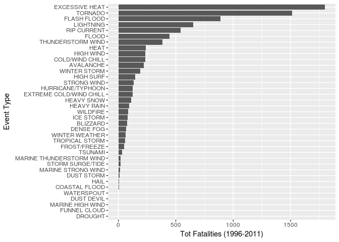

# Severe Weather Events in the US: Exploring Public Health and Economic Consequences

# Synopsis

Storms and other severe weather events can cause both public health and economic problems for communities and municipalities. Many severe events can result in fatalities, injuries, and property damage, and preventing such outcomes to the extent possible is a key concern. The objective of this analysis is to determine which types of events are the most harmful to population health and which ones have the greatest economic consequences.

We have analysed data from the U.S. National Oceanic and Atmospheric Administration's (NOAA) storm database which tracks characteristics of major storms and weather events in the United States. The analysis has been conducted for the events occurring between 1996 and 2011, which represents the time period where all 48 official event types have been recorded, with some filtering applied to include only the events causing either health or economic damage and to manually map non standard event types, which exists due to typos, to the standard ones. We've then filtered out varialbles which were not necessary for the analysis, derived some summary descriptions and total figures in terms of fatalities, injuries and property/crop damage grouped by event type.

We've found the most harmful events in terms of human health are tornadoes, excessive heat, floods and lightnings. Besides these, rip currents have a certain impact in terms of fatalities and thunderstorm winds in terms of injuries. In terms of economic damage, floods have major consequences together with strong wind storms. Also, major effects have of storm surge/tides and hail.

# Data Processing

## Getting the Raw Data

From the [Reproducible Research Course website](https://d396qusza40orc.cloudfront.net/repdata%2Fdata%2FStormData.csv.bz2) we obtain data about major storms and weather events in the United States, including estimates of any fatalities, injuries, and property damage.


```r
fileUrl <- "https://d396qusza40orc.cloudfront.net/repdata%2Fdata%2FStormData.csv.bz2"
inputFile <- "StormData.csv.bz2"
if(!file.exists(inputFile)) {
  download.file(fileUrl, destfile = inputFile, method = "curl")
}
```

## Reading the Data

We first read the data, including headers, from the raw compressed text file. The data is a CSV file with missing values coded as blank fields.


```r
library(dplyr)
```

```
## 
## Attaching package: 'dplyr'
```

```
## The following objects are masked from 'package:stats':
## 
##     filter, lag
```

```
## The following objects are masked from 'package:base':
## 
##     intersect, setdiff, setequal, union
```

```r
library(lubridate)
```

```
## 
## Attaching package: 'lubridate'
```

```
## The following object is masked from 'package:base':
## 
##     date
```

```r
library(data.table)
```

```
## -------------------------------------------------------------------------
```

```
## data.table + dplyr code now lives in dtplyr.
## Please library(dtplyr)!
```

```
## -------------------------------------------------------------------------
```

```
## 
## Attaching package: 'data.table'
```

```
## The following objects are masked from 'package:lubridate':
## 
##     hour, isoweek, mday, minute, month, quarter, second, wday,
##     week, yday, year
```

```
## The following objects are masked from 'package:dplyr':
## 
##     between, first, last
```

```r
library(stringdist)
```


```r
stormdata <- fread(sprintf("bzcat %s", "StormData.csv.bz2"))
```

```
## 
Read 25.8% of 967216 rows
Read 50.7% of 967216 rows
Read 68.2% of 967216 rows
Read 78.6% of 967216 rows
Read 92.0% of 967216 rows
Read 902297 rows and 37 (of 37) columns from 0.523 GB file in 00:00:07
```

After reading the data we check the dimension and the first few rows:


```r
dim(stormdata)
```

```
## [1] 902297     37
```

```r
head(stormdata)
```

```
##    STATE__           BGN_DATE BGN_TIME TIME_ZONE COUNTY COUNTYNAME STATE
## 1:       1  4/18/1950 0:00:00     0130       CST     97     MOBILE    AL
## 2:       1  4/18/1950 0:00:00     0145       CST      3    BALDWIN    AL
## 3:       1  2/20/1951 0:00:00     1600       CST     57    FAYETTE    AL
## 4:       1   6/8/1951 0:00:00     0900       CST     89    MADISON    AL
## 5:       1 11/15/1951 0:00:00     1500       CST     43    CULLMAN    AL
## 6:       1 11/15/1951 0:00:00     2000       CST     77 LAUDERDALE    AL
##     EVTYPE BGN_RANGE BGN_AZI BGN_LOCATI END_DATE END_TIME COUNTY_END
## 1: TORNADO         0                                               0
## 2: TORNADO         0                                               0
## 3: TORNADO         0                                               0
## 4: TORNADO         0                                               0
## 5: TORNADO         0                                               0
## 6: TORNADO         0                                               0
##    COUNTYENDN END_RANGE END_AZI END_LOCATI LENGTH WIDTH F MAG FATALITIES
## 1:         NA         0                      14.0   100 3   0          0
## 2:         NA         0                       2.0   150 2   0          0
## 3:         NA         0                       0.1   123 2   0          0
## 4:         NA         0                       0.0   100 2   0          0
## 5:         NA         0                       0.0   150 2   0          0
## 6:         NA         0                       1.5   177 2   0          0
##    INJURIES PROPDMG PROPDMGEXP CROPDMG CROPDMGEXP WFO STATEOFFIC ZONENAMES
## 1:       15    25.0          K       0                                    
## 2:        0     2.5          K       0                                    
## 3:        2    25.0          K       0                                    
## 4:        2     2.5          K       0                                    
## 5:        2     2.5          K       0                                    
## 6:        6     2.5          K       0                                    
##    LATITUDE LONGITUDE LATITUDE_E LONGITUDE_ REMARKS REFNUM
## 1:     3040      8812       3051       8806              1
## 2:     3042      8755          0          0              2
## 3:     3340      8742          0          0              3
## 4:     3458      8626          0          0              4
## 5:     3412      8642          0          0              5
## 6:     3450      8748          0          0              6
```

There are 902297 observations in this data set, with 37 variables.

## Filtering Data

The events in the database start in year 1950 and end in 2011. According to [NOAA official documentation](https://www.ncdc.noaa.gov/stormevents/pd01016005curr.pdf) (page 6), there are 48 official event types. However, only a small fraction of these have been consistently recorded across the above time range. As described in the [Storm Events Database Details](https://www.ncdc.noaa.gov/stormevents/details.jsp?type=eventtype), from 1950 through 1954, only tornado events were recorded. From 1955 to 1995, only tornado, thunderstorm wind and hail events have been recorded in the database. Since 1996, all 48 official events are being recorded.

Convert the events start dates, which are strings in the format MM/DD/YYYY HH:MM:SS, to R dates:


```r
stormdata <- stormdata %>% mutate(BGN_DATE = mdy_hms(BGN_DATE))
```

It is a legitimate goal here to show results comparing all 48 official event types within the same time period. For this reason, we filter out the records previous to 1996:


```r
stormdata <- stormdata %>% filter(year(BGN_DATE) >= 1996)
```

Ignore the events that do not cause any loss, either in terms of human or physical damage:


```r
stormdata <- stormdata %>% filter(FATALITIES | INJURIES | PROPDMG | CROPDMG)
```

For each observation, compute the total value for property and crop damage. In order to do that, we need to multiply the values in PROPDMG (resp. CROPDMG) by a value encoded in the corresponding PROPDMGEXP (resp. CROPDMGEXP) varialble, which is alphanumeric. These are the possible codes for the multiplier variables:


```r
unique(stormdata$PROPDMGEXP)
```

```
## [1] "K" ""  "M" "B"
```

```r
unique(stormdata$CROPDMGEXP)
```

```
## [1] "K" ""  "M" "B"
```
Among all possible alphanumeric codes, after the previous filtering only 4 remains, including the empty character: "K", "M", "B" mean respectively thousands, millions and billions. According to [](), the blank character map to a 0 multiplier. We overwrite the property and crop damage variable with their respective total taking into account the multipliers:


```r
totaldmg <- function(dmg, mult) {
  total = 0
  if(mult == "K") { total = dmg * 1000 } 
  else if(mult == "M") { total = dmg * 1e06 } 
  else if(mult == "B") { total = dmg * 1e09 }
  total
}
stormdata <- 
  stormdata %>% 
  rowwise() %>% 
  mutate(CROPDMG = totaldmg(CROPDMG,CROPDMGEXP), PROPDMG = totaldmg(PROPDMG,PROPDMGEXP))
```

As mentioned before, there are 48 official event types, which are defined here. 


```r
official_events <-c("ASTRONOMICAL LOW TIDE","AVALANCHE","BLIZZARD","COASTAL FLOOD","COLD/WIND CHILL","DEBRIS FLOW","DENSE FOG","DENSE SMOKE","DROUGHT","DUST DEVIL","DUST STORM","EXCESSIVE HEAT","EXTREME COLD/WIND CHILL","FLASH FLOOD","FLOOD","FROST/FREEZE","FUNNEL CLOUD","FREEZING FOG","HAIL","HEAT","HEAVY RAIN","HEAVY SNOW","HIGH SURF","HIGH WIND","HURRICANE/TYPHOON","ICE STORM","LAKE-EFFECT SNOW","LAKESHORE FLOOD","LIGHTNING","MARINE HAIL","MARINE HIGH WIND","MARINE STRONG WIND","MARINE THUNDERSTORM WIND","RIP CURRENT","SEICHE","SLEET","STORM SURGE/TIDE","STRONG WIND","THUNDERSTORM WIND","TORNADO","TROPICAL DEPRESSION","TROPICAL STORM","TSUNAMI","VOLCANIC ASH","WATERSPOUT","WILDFIRE","WINTER STORM","WINTER WEATHER")
```

The so far filtered dataset contains much more event types due to typos, e.g leading/trailing spaces, plurals, and non standard nomenclature. A first trivial step is to convert all events to upper case and remove leading and trailing spaces


```r
stormdata <- stormdata %>% mutate(EVTYPE = trimws(toupper(EVTYPE)))
```

which leaves us with 183 event types. 

This is the list of non standard events in the filtered dataset:


```r
events <- sort(unique(stormdata$EVTYPE))
nostd_events <- events[is.na(match(events, official_events))]
nostd_events
```

```
##   [1] "AGRICULTURAL FREEZE"       "ASTRONOMICAL HIGH TIDE"   
##   [3] "BEACH EROSION"             "BLACK ICE"                
##   [5] "BLOWING DUST"              "BLOWING SNOW"             
##   [7] "BRUSH FIRE"                "COASTAL EROSION"          
##   [9] "COASTAL FLOODING"          "COASTAL  FLOODING/EROSION"
##  [11] "COASTAL FLOODING/EROSION"  "COASTALSTORM"             
##  [13] "COASTAL STORM"             "COLD"                     
##  [15] "COLD AND SNOW"             "COLD TEMPERATURE"         
##  [17] "COLD WEATHER"              "DAMAGING FREEZE"          
##  [19] "DAM BREAK"                 "DOWNBURST"                
##  [21] "DROWNING"                  "DRY MICROBURST"           
##  [23] "EARLY FROST"               "EROSION/CSTL FLOOD"       
##  [25] "EXCESSIVE SNOW"            "EXTENDED COLD"            
##  [27] "EXTREME COLD"              "EXTREME WINDCHILL"        
##  [29] "FALLING SNOW/ICE"          "FLASH FLOOD/FLOOD"        
##  [31] "FLOOD/FLASH/FLOOD"         "FOG"                      
##  [33] "FREEZE"                    "FREEZING DRIZZLE"         
##  [35] "FREEZING RAIN"             "FREEZING SPRAY"           
##  [37] "FROST"                     "GLAZE"                    
##  [39] "GRADIENT WIND"             "GUSTY WIND"               
##  [41] "GUSTY WIND/HAIL"           "GUSTY WIND/HVY RAIN"      
##  [43] "GUSTY WIND/RAIN"           "GUSTY WINDS"              
##  [45] "HARD FREEZE"               "HAZARDOUS SURF"           
##  [47] "HEAT WAVE"                 "HEAVY RAIN/HIGH SURF"     
##  [49] "HEAVY SEAS"                "HEAVY SNOW SHOWER"        
##  [51] "HEAVY SURF"                "HEAVY SURF AND WIND"      
##  [53] "HEAVY SURF/HIGH SURF"      "HIGH SEAS"                
##  [55] "HIGH SURF ADVISORY"        "HIGH SWELLS"              
##  [57] "HIGH WATER"                "HIGH WIND (G40)"          
##  [59] "HIGH WINDS"                "HURRICANE"                
##  [61] "HURRICANE EDOUARD"         "HYPERTHERMIA/EXPOSURE"    
##  [63] "HYPOTHERMIA/EXPOSURE"      "ICE JAM FLOOD (MINOR"     
##  [65] "ICE ON ROAD"               "ICE ROADS"                
##  [67] "ICY ROADS"                 "LAKE EFFECT SNOW"         
##  [69] "LANDSLIDE"                 "LANDSLIDES"               
##  [71] "LANDSLUMP"                 "LANDSPOUT"                
##  [73] "LATE SEASON SNOW"          "LIGHT FREEZING RAIN"      
##  [75] "LIGHT SNOW"                "LIGHT SNOWFALL"           
##  [77] "MARINE ACCIDENT"           "MARINE TSTM WIND"         
##  [79] "MICROBURST"                "MIXED PRECIP"             
##  [81] "MIXED PRECIPITATION"       "MUDSLIDE"                 
##  [83] "MUD SLIDE"                 "MUDSLIDES"                
##  [85] "NON-SEVERE WIND DAMAGE"    "NON TSTM WIND"            
##  [87] "NON-TSTM WIND"             "OTHER"                    
##  [89] "RAIN"                      "RAIN/SNOW"                
##  [91] "RECORD HEAT"               "RIP CURRENTS"             
##  [93] "RIVER FLOOD"               "RIVER FLOODING"           
##  [95] "ROCK SLIDE"                "ROGUE WAVE"               
##  [97] "ROUGH SEAS"                "ROUGH SURF"               
##  [99] "SMALL HAIL"                "SNOW"                     
## [101] "SNOW AND ICE"              "SNOW SQUALL"              
## [103] "SNOW SQUALLS"              "STORM SURGE"              
## [105] "STRONG WINDS"              "THUNDERSTORM"             
## [107] "THUNDERSTORM WIND (G40)"   "TIDAL FLOODING"           
## [109] "TORRENTIAL RAINFALL"       "TSTM WIND"                
## [111] "TSTM WIND 40"              "TSTM WIND (41)"           
## [113] "TSTM WIND 45"              "TSTM WIND AND LIGHTNING"  
## [115] "TSTM WIND (G35)"           "TSTM WIND (G40)"          
## [117] "TSTM WIND G45"             "TSTM WIND  (G45)"         
## [119] "TSTM WIND (G45)"           "TSTM WIND/HAIL"           
## [121] "TYPHOON"                   "UNSEASONABLE COLD"        
## [123] "UNSEASONABLY COLD"         "UNSEASONABLY WARM"        
## [125] "UNSEASONAL RAIN"           "URBAN/SML STREAM FLD"     
## [127] "WARM WEATHER"              "WET MICROBURST"           
## [129] "WHIRLWIND"                 "WILD/FOREST FIRE"         
## [131] "WIND"                      "WIND AND WAVE"            
## [133] "WIND DAMAGE"               "WINDS"                    
## [135] "WINTER WEATHER MIX"        "WINTER WEATHER/MIX"       
## [137] "WINTRY MIX"
```

There are 137 non standard events. The majority of these events can be almost directly mapped to the official ones:


```r
blizzard <- c("BLOWING SNOW","EXCESSIVE SNOW","FALLING SNOW/ICE","SNOW SQUALL","SNOW SQUALLS")
stormdata[stormdata$EVTYPE %in% blizzard,"EVTYPE"] = "BLIZZARD"

coastal_flood <- c("COASTAL FLOODING","COASTAL  FLOODING/EROSION","COASTAL FLOODING/EROSION","EROSION/CSTL FLOOD","TIDAL FLOODING")
stormdata[stormdata$EVTYPE %in% coastal_flood,"EVTYPE"] = "COASTAL FLOOD"

cold_wind_chill <- c("EXTENDED COLD","EXTREME COLD","EXTREME WINDCHILL","HYPOTHERMIA/EXPOSURE","UNSEASONABLE COLD","UNSEASONABLY COLD")
stormdata[stormdata$EVTYPE %in% cold_wind_chill,"EVTYPE"] = "COLD/WIND CHILL"

stormdata[stormdata$EVTYPE == "FOG","EVTYPE"] = "DENSE FOG"
stormdata[stormdata$EVTYPE == "BLOWING DUST","EVTYPE"] = "DUST STORM"

frost_freeze <- c("AGRICULTURAL FREEZE","BLACK ICE","COLD","COLD AND SNOW","COLD TEMPERATURE","COLD WEATHER","DAMAGING FREEZE","EARLY FROST","FREEZE","FREEZING DRIZZLE","FREEZING RAIN","FREEZING SPRAY","FROST","GLAZE","HARD FREEZE","ICE ON ROAD","ICE ROADS","ICY ROADS","LIGHT FREEZING RAIN","SNOW AND ICE")
stormdata[stormdata$EVTYPE %in% frost_freeze,"EVTYPE"] = "FROST/FREEZE"

flood <- c("ICE JAM FLOOD (MINOR","RIVER FLOOD","RIVER FLOODING","URBAN/SML STREAM FLD")
stormdata[stormdata$EVTYPE %in% flood,"EVTYPE"] = "FLOOD"

flash_flood <- c("FLASH FLOOD/FLOOD","FLOOD/FLASH/FLOOD")
stormdata[stormdata$EVTYPE %in% flash_flood,"EVTYPE"] = "FLASH FLOOD"

excessive_heat <- c("HEAT WAVE","RECORD HEAT")
stormdata[stormdata$EVTYPE %in% excessive_heat,"EVTYPE"] = "EXCESSIVE HEAT"

stormdata[stormdata$EVTYPE == "SMALL HAIL","EVTYPE"] = "HAIL"

heat <- c("HYPERTHERMIA/EXPOSURE","UNSEASONABLY WARM","WARM WEATHER")
stormdata[stormdata$EVTYPE %in% heat,"EVTYPE"] = "HEAT"

stormdata[stormdata$EVTYPE == "HEAVY SNOW SHOWER","EVTYPE"] = "HEAVY SNOW"

heavy_rain <- c("RAIN","TORRENTIAL RAINFALL","UNSEASONAL RAIN")
stormdata[stormdata$EVTYPE %in% heavy_rain,"EVTYPE"] = "HEAVY RAIN"

heavy_snow <- c("LATE SEASON SNOW", "RAIN/SNOW","SNOW")
stormdata[stormdata$EVTYPE %in% heavy_snow,"EVTYPE"] = "HEAVY SNOW"

high_surf <- c("HAZARDOUS SURF","HEAVY RAIN/HIGH SURF", "HEAVY SURF","HEAVY SURF AND WIND","HEAVY SURF/HIGH SURF","HIGH SURF ADVISORY","ROUGH SURF")
stormdata[stormdata$EVTYPE %in% high_surf,"EVTYPE"] = "HIGH SURF"

hurricane_typhoon <- c("HURRICANE", "HURRICANE EDOUARD","TYPHOON")
stormdata[stormdata$EVTYPE %in% hurricane_typhoon,"EVTYPE"] = "HURRICANE/TYPHOON"

stormdata[stormdata$EVTYPE == "RIP CURRENTS","EVTYPE"] = "RIP CURRENT"
stormdata[stormdata$EVTYPE == "MARINE TSTM WIND","EVTYPE"] = "MARINE THUNDERSTORM WIND"

storm_surge_tide <- c("COASTALSTORM","COASTAL STORM","STORM SURGE")
stormdata[stormdata$EVTYPE %in% storm_surge_tide,"EVTYPE"] = "STORM SURGE/TIDE"

strong_wind <- c("GRADIENT WIND","GUSTY WIND","GUSTY WIND/HAIL","GUSTY WIND/HVY RAIN","GUSTY WIND/RAIN","GUSTY WINDS","HIGH WIND (G40)","HIGH WINDS","NON TSTM WIND","NON-TSTM WIND","WHIRLWIND","WIND","WIND AND WAVE","WIND DAMAGE","WINDS","STRONG WINDS")
stormdata[stormdata$EVTYPE %in% strong_wind,"EVTYPE"] = "STRONG WIND"

tstm_wind <- c("DOWNBURST","DRY MICROBURST","MICROBURST","TSTM WIND","TSTM WIND 40","TSTM WIND (41)","TSTM WIND 45","TSTM WIND AND LIGHTNING","TSTM WIND (G35)","TSTM WIND (G40)","TSTM WIND G45","TSTM WIND  (G45)","TSTM WIND (G45)","TSTM WIND/HAIL","THUNDERSTORM","THUNDERSTORM WIND (G40)","WET MICROBURST")
stormdata[stormdata$EVTYPE %in% tstm_wind,"EVTYPE"] = "THUNDERSTORM WIND"

stormdata[stormdata$EVTYPE == "WILD/FOREST FIRE","EVTYPE"] = "WILDFIRE"

winter_weather <- c("WINTER WEATHER MIX","WINTER WEATHER/MIX","WINTRY MIX")
stormdata[stormdata$EVTYPE %in% winter_weather,"EVTYPE"] = "WINTER WEATHER"
```
Here we get the remaining non standard events which cannot be intuitively mapped to the official ones:


```r
events <- sort(unique(stormdata$EVTYPE))
nostd_events <- events[is.na(match(events, official_events))]
nostd_events
```

```
##  [1] "ASTRONOMICAL HIGH TIDE" "BEACH EROSION"         
##  [3] "BRUSH FIRE"             "COASTAL EROSION"       
##  [5] "DAM BREAK"              "DROWNING"              
##  [7] "HEAVY SEAS"             "HIGH SEAS"             
##  [9] "HIGH SWELLS"            "HIGH WATER"            
## [11] "LAKE EFFECT SNOW"       "LANDSLIDE"             
## [13] "LANDSLIDES"             "LANDSLUMP"             
## [15] "LANDSPOUT"              "LIGHT SNOW"            
## [17] "LIGHT SNOWFALL"         "MARINE ACCIDENT"       
## [19] "MIXED PRECIP"           "MIXED PRECIPITATION"   
## [21] "MUDSLIDE"               "MUD SLIDE"             
## [23] "MUDSLIDES"              "NON-SEVERE WIND DAMAGE"
## [25] "OTHER"                  "ROCK SLIDE"            
## [27] "ROGUE WAVE"             "ROUGH SEAS"
```

and whose observations are then filtered out from the dataset:


```r
stormdata <-
  stormdata %>% filter(!(EVTYPE %in% nostd_events))
```
Finally, we retain only the variables necessary for the analysis:


```r
stormdata <-
  stormdata %>% select(BGN_DATE, STATE, EVTYPE, FATALITIES, INJURIES, PROPDMG, CROPDMG)
```

# Data Analysis

A quick glimpse into the filtered dataset:

```r
dim(stormdata)
```

```
## [1] 200880      7
```

```r
head(stormdata)
```

```
## # A tibble: 6 x 7
##     BGN_DATE STATE            EVTYPE FATALITIES INJURIES PROPDMG CROPDMG
##       <dttm> <chr>             <chr>      <dbl>    <dbl>   <dbl>   <dbl>
## 1 1996-01-06    AL      WINTER STORM          0        0  380000   38000
## 2 1996-01-11    AL           TORNADO          0        0  100000       0
## 3 1996-01-11    AL THUNDERSTORM WIND          0        0    3000       0
## 4 1996-01-11    AL THUNDERSTORM WIND          0        0    5000       0
## 5 1996-01-11    AL THUNDERSTORM WIND          0        0    2000       0
## 6 1996-01-18    AL         HIGH WIND          0        0  400000       0
```
The filtered dataset contains 200880 each with 7 variables.

These are the recorded event types:

```r
events <- sort(unique(stormdata$EVTYPE))
```
Among the official 48 event types, 46 are recorded.


```r
official_events[is.na(match(official_events, events))]
```

```
## [1] "DEBRIS FLOW" "SLEET"
```
In this dataset, "DEBRIS FLOW" and "SLEET" are not recorded.

In this exploratory and subsequent analysis, for the purpose of investigating health and economic consequences it is more appropriate to split the dataset in two parts: one with only health consequences and one with only economic consequences:


```r
health <- 
  stormdata %>% filter(FATALITIES !=0 | INJURIES != 0)
property <-
  stormdata %>% filter(PROPDMG != 0 | CROPDMG != 0)
```
Events generally tend to produce far more economic damage than human loss or injuries:

```r
nrow(health)
```

```
## [1] 12716
```

```r
nrow(property)
```

```
## [1] 194116
```

This is a summary in terms of consequences to the population:

```r
summary(health$FATALITIES)
```

```
##     Min.  1st Qu.   Median     Mean  3rd Qu.     Max. 
##   0.0000   0.0000   0.0000   0.6817   1.0000 158.0000
```

```r
summary(health$INJURIES)
```

```
##    Min. 1st Qu.  Median    Mean 3rd Qu.    Max. 
##    0.00    0.00    1.00    4.55    2.00 1150.00
```
On average, there has been less around one casualty/five injuries per event. The distributions seem to be particularly skewed towards low values and the max values indicate the presence of outliers.


```r
health[which.max(health$FATALITIES),]
```

```
## # A tibble: 1 x 7
##     BGN_DATE STATE  EVTYPE FATALITIES INJURIES PROPDMG CROPDMG
##       <dttm> <chr>   <chr>      <dbl>    <dbl>   <dbl>   <dbl>
## 1 2011-05-22    MO TORNADO        158     1150 2.8e+09       0
```
The max values both correspond to the [Tornado outbreak sequence of May 21-26 2011](https://en.wikipedia.org/wiki/Tornado_outbreak_sequence_of_May_21%E2%80%9326,_2011).

These are the total number of casualties and injuries:

```r
sum(health$FATALITIES)
```

```
## [1] 8668
```

```r
sum(health$INJURIES)
```

```
## [1] 57863
```


We now transform the data to get the total number of fatalities and injuries grouped by event type:

```r
health_sum_by_evt <-
  health %>%
  group_by(EVTYPE) %>% 
  summarise(tot_fat = sum(FATALITIES), tot_inj = sum(INJURIES))
```

```
## Warning: Grouping rowwise data frame strips rowwise nature
```

```r
head(health_sum_by_evt)
```

```
## # A tibble: 6 x 3
##            EVTYPE tot_fat tot_inj
##             <chr>   <dbl>   <dbl>
## 1       AVALANCHE     223     156
## 2        BLIZZARD      75     424
## 3   COASTAL FLOOD       6       8
## 4 COLD/WIND CHILL     235      96
## 5       DENSE FOG      69     855
## 6         DROUGHT       0       4
```

This is a summary in terms of economic damage:

```r
summary(property$PROPDMG)
```

```
##      Min.   1st Qu.    Median      Mean   3rd Qu.      Max. 
## 0.000e+00 2.000e+03 1.000e+04 1.888e+06 3.000e+04 1.150e+11
```

```r
summary(property$CROPDMG)
```

```
##      Min.   1st Qu.    Median      Mean   3rd Qu.      Max. 
## 0.000e+00 0.000e+00 0.000e+00 1.789e+05 0.000e+00 1.510e+09
```
On average, damaging events produce hundreds of thousands of dollars of damage. The vast majority of them do not have major economic consequences. There are notable exceptions:


```r
property[which.max(property$PROPDMG),]
```

```
## # A tibble: 1 x 7
##     BGN_DATE STATE EVTYPE FATALITIES INJURIES  PROPDMG  CROPDMG
##       <dttm> <chr>  <chr>      <dbl>    <dbl>    <dbl>    <dbl>
## 1 2006-01-01    CA  FLOOD          0        0 1.15e+11 32500000
```

```r
property[which.max(property$CROPDMG),]
```

```
## # A tibble: 1 x 7
##     BGN_DATE STATE            EVTYPE FATALITIES INJURIES  PROPDMG
##       <dttm> <chr>             <chr>      <dbl>    <dbl>    <dbl>
## 1 2005-08-29    MS HURRICANE/TYPHOON         15      104 5.88e+09
## # ... with 1 more variables: CROPDMG <dbl>
```
The former event refers to flooding in California occurred in January 2006. The latter event is Hurricane Katrina which hit the US Gulf Coast in August 2005.

These are the estimates of total values of property and crop damages:

```r
sum(property$PROPDMG)
```

```
## [1] 366426101780
```

```r
sum(health$CROPDMG)
```

```
## [1] 5368431100
```

Overall, since 1996 various events have produces damages for hundreds of billions of dollars on property and around five billions of dollars in agriculture.

Let's transform the data by merging property and crop damange estimates together and grouping by event type:

```r
eco_sum_by_evt <-
  property %>%
  mutate(DMG = PROPDMG + CROPDMG) %>% 
  group_by(EVTYPE) %>%
  summarise(tot_dmg = sum(DMG))
```

```
## Warning: Grouping rowwise data frame strips rowwise nature
```

```r
head(eco_sum_by_evt)
```

```
## # A tibble: 6 x 2
##                  EVTYPE    tot_dmg
##                   <chr>      <dbl>
## 1 ASTRONOMICAL LOW TIDE     320000
## 2             AVALANCHE    3711800
## 3              BLIZZARD  534768950
## 4         COASTAL FLOOD  406452560
## 5       COLD/WIND CHILL 1379320900
## 6             DENSE FOG   20464500
```

# Results

## Which type of events are the most harmful to population health?

We answer the question by separately considering the effects of each event type in terms of fatalities and injuries. Firstly, we determine the deadliest event types: 

```r
head(health_sum_by_evt %>% arrange(desc(tot_fat)) %>% select(EVTYPE, tot_fat))
```

```
## # A tibble: 6 x 2
##           EVTYPE tot_fat
##            <chr>   <dbl>
## 1 EXCESSIVE HEAT    1799
## 2        TORNADO    1511
## 3    FLASH FLOOD     887
## 4      LIGHTNING     651
## 5    RIP CURRENT     542
## 6          FLOOD     444
```

This is an overview of the impact of all event types on human loss: 

```r
library(ggplot2)
g <- ggplot(health_sum_by_evt, aes(reorder(EVTYPE,tot_fat), tot_fat)) + 
  geom_col() + 
  coord_flip() + 
  xlab("Event Type") + ylab("Tot Fatalities (1996-2011)")
plot(g)
```



Secondly, we derive the event types which are more impactful in terms of injuries to the population:

```r
head(health_sum_by_evt %>% arrange(desc(tot_inj)) %>% select(EVTYPE, tot_inj))
```

```
## # A tibble: 6 x 2
##              EVTYPE tot_inj
##               <chr>   <dbl>
## 1           TORNADO   20667
## 2             FLOOD    6838
## 3    EXCESSIVE HEAT    6461
## 4 THUNDERSTORM WIND    5154
## 5         LIGHTNING    4141
## 6       FLASH FLOOD    1674
```

and similarly we plot an overview of the total injuries for all event types:

```r
g <- ggplot(health_sum_by_evt, aes(reorder(EVTYPE,tot_inj), tot_inj)) + 
  geom_col() + 
  coord_flip() + 
  xlab("Event Type") + ylab("Tot Injuries (1996-2011)")
plot(g)
```


If we consider the combined effect on fatalities and injuries, the **most harmful events are tornadoes, excessive heat, floods and lightnings**. Besides these, **rip currents** have a certain impact in terms of fatalities and **thunderstorm winds** in terms of injuries. 

## Which types of events have the greatest economic consequences?

Let's show the most damaging event types:


```r
head(eco_sum_by_evt %>% arrange(desc(tot_dmg)))
```

```
## # A tibble: 6 x 2
##              EVTYPE      tot_dmg
##               <chr>        <dbl>
## 1             FLOOD 149142742700
## 2 HURRICANE/TYPHOON  87068996810
## 3  STORM SURGE/TIDE  47835629000
## 4           TORNADO  24900370720
## 5              HAIL  17092035870
## 6       FLASH FLOOD  16557170610
```

and an overview of the estimates of the damage for each event type:


```r
g <- ggplot(eco_sum_by_evt, aes(reorder(EVTYPE,tot_dmg), tot_dmg)) + 
  geom_col() + 
  coord_flip() + 
  xlab("Event Type") + ylab("Tot Damage in US $ (1996-2011)")
plot(g)
```


As with the case of human health, **floods have major (economic) consequences together with strong wind storms (hurricanes/typhoons/tornadoes)**. Also, it turns out that also **storm surge/tides and hail have major effects** in terms of economic damage.
